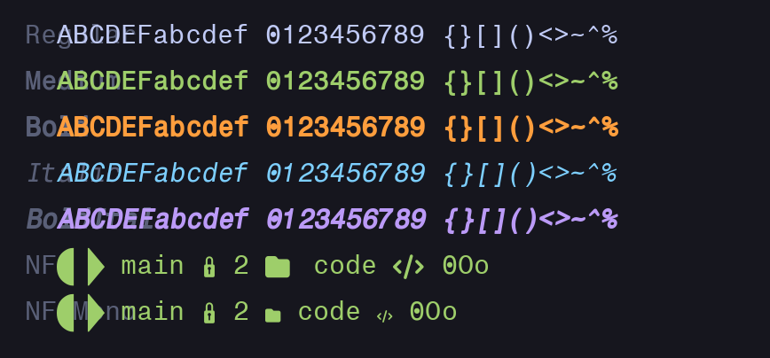
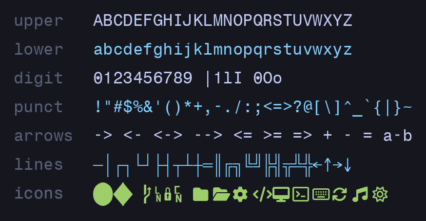

# HE_TERMINAL

Personal monospaced terminal font: dotted zero, synthesized
**Medium / Bold / Italic / Bold Italic**, and **Nerd Fonts v3** icon
patches in standard and Mono flavors. Built from one source TTF by a
fully scripted pipeline.



## Install

```sh
make check-deps   # verify toolchain
make install      # build 15 TTFs -> ~/.fonts/HE_TERMINAL + fc-cache
```

Then point your terminal at one of:

| Family | Use when |
|--------|----------|
| `HE_TERMINAL` | plain text, no icons |
| `HE_TERMINAL Nerd Font` | full icon set, oversized icons take two cells |
| `HE_TERMINAL Nerd Font Mono` | icons squeezed into one cell (safest) |



## Build

Everything runs through the Makefile — never run the scripts by hand.

```sh
make            # build into fonts/
make preview    # regenerate the PNGs above
make clean      # remove build/, fonts/, previews/
```

Two knobs (force rebuild with `-B` after changing):

```sh
make -B install SLANT=12 BOLD_WIDTH=120 MEDIUM_WIDTH=60   # italic angle, stroke widths
```

Dependencies on Arch: `make fontforge python-fonttools
python-skia-pathops ttfautohint git unzip`. If system Python lacks
`skia-pathops`, build under a venv instead of touching the Makefile:

```sh
python3 -m venv --system-site-packages .venv
.venv/bin/pip install skia-pathops
make PY=$PWD/.venv/bin/python
```

## How it works

`src/tt0596m_.ttf.orig` → dotted zero → medium/bold/oblique
synthesis → Nerd Fonts patcher (`--complete --careful`) → name/icon fixes →
wide + Mono variants → ttfautohint on every synthesized face.

Design notes:

- Strictly monospaced cells everywhere, dotted zero in every face,
  no ligatures.
- The source font's own PUA icons are cleared pre-patch so proper
  Nerd Fonts outlines land there; icon outlines are unified across
  weights so they match pixel-for-pixel.
- Fresh machines only need `make check-deps && make install`; only
  `scripts/`, `Makefile`, and `src/` are tracked.

## Notes

- If non-Mono Nerd icons overlap in your terminal, it ignores
  per-glyph advances — switch to `HE_TERMINAL Nerd Font Mono`.
- Upstream license of the source TTF is unclear; treat accordingly
  before redistributing.
